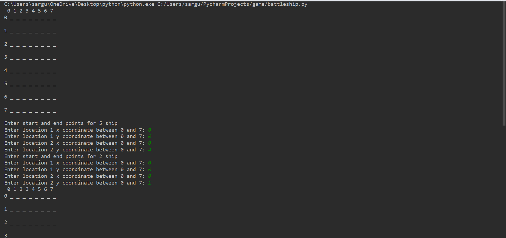

# Battlefied-Python-game

This is the classic battleship game coded in python. The player has to beat the computer in order to win. The game begins when the player decides the location of his ships and the computer does too. Then they take turns shooting at random points and continue till one of the players sinks both the other player's ships and wins. 

